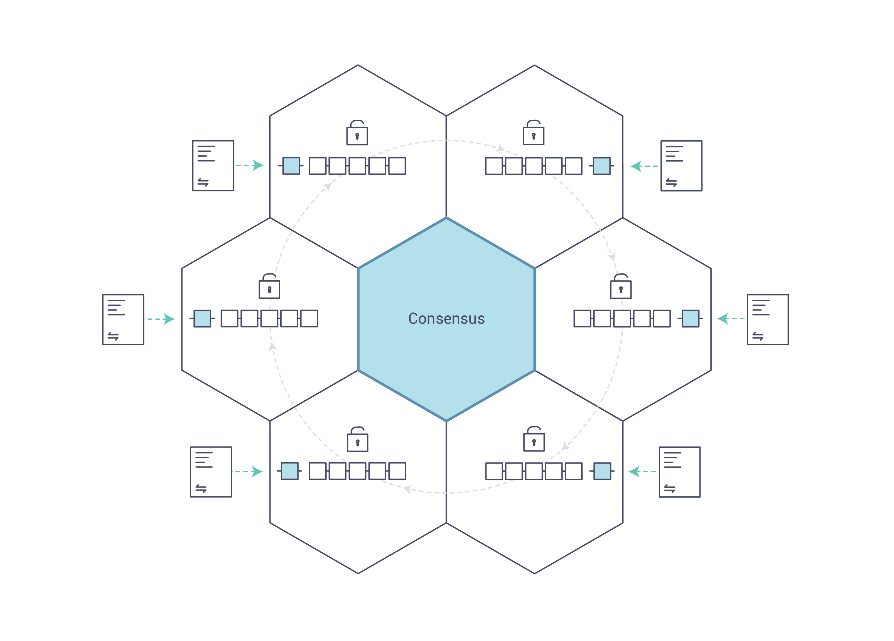
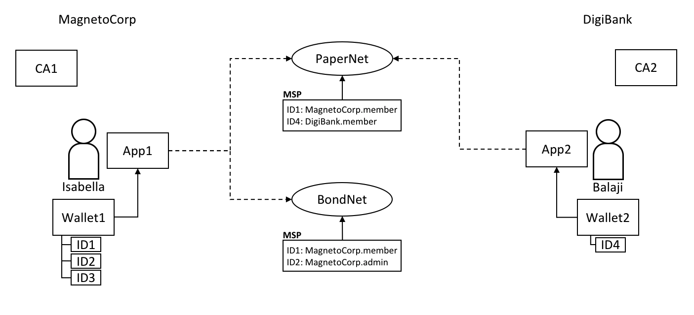

### 什么是区块链

一个分布式账本

区块链网络的核心是分布式账本，记录了网络上发生的所有交易记录。

区块链账本通常被认为是去中心化的，因为重复被许多网络参与者存储，每个网络参与者都协作参与它的维护。

### 智能合约

为了支持信息的一致更新，并启用一整套账本功能（交易、查询等），区块链网络使用**智能合约**提供对账本的受控访问。

### 共识（Consensus）

使账本交易在网络上保持同步的过程被称为共识，即确保账本只在交易得到合法参与者1.01的批准时更新，并且当账本更新时，它们以相同的顺序更新相同的交易。

### 钱包（Wallet）

钱包包含了用户身份（user identity）集合。当用户运行的应用程序连接通道时，会从集合中选择一个身份。对通道资源（如账本）的访问权限是身份与MSP结合使用来确定的。

应用程序连接到网络通道时会选择一个用户身份，如 `ID1`。通道 MSP 将 `ID1` 与特定组织中的角色相关联，此决算最终决定应用程序对通道资源的权限。例如，`ID1` 可能把一个用户标识成为某组织的成员，该用户可以对账本进行读写操作，而 `ID2` 可能被标识为组织的管理员，它可以添加eyige新的组织到联盟。

上图中两个用户，Isabella 和 Balaji 的钱包包含不同的身份，可以用来连接不同的网络通道，如 PaperNet 和 BondNet。来自 MagnetoCorp 的 Isabella 可以使用 APP 1 来调用 PaperNet 与 BondNet 中的智能合约，而 来自 DigiBank 的 Balaji 可以通过 APP2 来调用 PaperNet 中的智能合约。