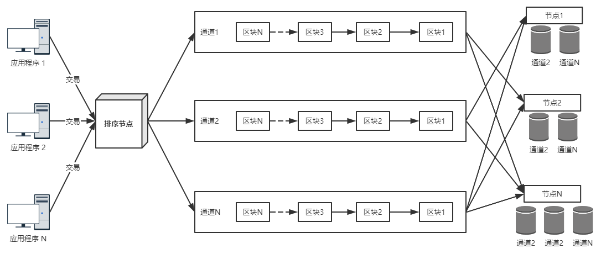

### 交易的三个阶段

* 交易背书（Endorser）：客户端节点根据背书策略向背书接项目发送交易提案，背书节点利用智能合约执行交易，执行完成后，对结果进行签名背书后返回给客户端。
* **交易排序（Orderer）**：排序节点接收经过签名背书的交易，对交易进行排序，将排好序的交易打包成区块，广播到其它组织的主节点，排序节点不关心交易是否正确。
* 交易验证（Committer）：区块存储前对交易进行验证，无效的交易只会被记录在交易历史中，并不会改变区块链状态，在 Fabric 中，状态是指世界性状态。类比到 MySQL 中，区块中存储的是 SQL 语句，更新状态对应存储更新后的数据，对于无效交易，则相当于只存储了无效的 SQL 语句。

### Orderer

Orderer的三个功能：

* 交易排序
* 区块分发
* 多通道数据隔离

#### 交易排序

交易排序的目的是保证系统交易顺序的一致性（**有限状态机**）。有限状态机是指，如果一个写传统从最初始得状态开始，如果每个状态改变的条件都一致，则一定会会得到一致的结果。区块链是分布式系统，网络中有许多节点，且计算过程都是独立的，要保证每个节点一致，就要保证交易顺序一致，只有交易顺序一致，改变条件才能一致，才能保证得到相同结果。

排序类型：
solo：单节点排序，所见即所得。
kafka：外置消息队列保证一致性。

#### 区块分发

排序节点产生的区块并非是每个记账节点在本地存储的区块，即非落盘区块，只是一个中间状态区块，包含了排序节点收到的所有交易，不管交易是否有效，均会打包成区块进行广播。

#### 多通道数据隔离

所有应用程序都向排序节点提交交易，客户端在提交交易时指定通道，表明该交易发往哪个通道，排序节点收到交易后，按照通道进行拆分，拆分后再进行排序，即排序根据通道单独排序，根据通道进行区块封装。多通道的模型可以理解为发布-订阅模型，我们可以为一组业务逻辑分配一个通道，各个组织的节点都可以订阅这个通道。通道之间相互隔离，并不知道彼此的存在，但每个组织的节点可以订阅多个通道。

### 源码解读

排序接口

基于 solo 的排序服务

基于 kafka 的排序服务

自由实现排序服务